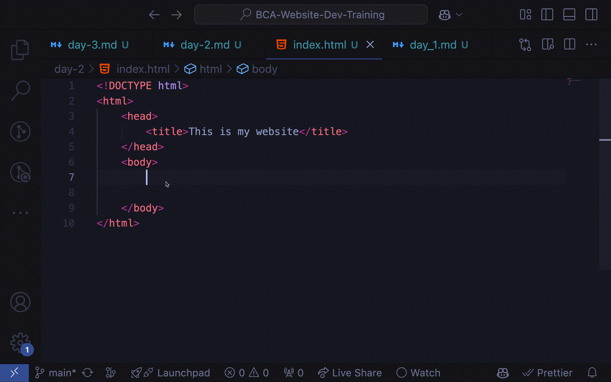
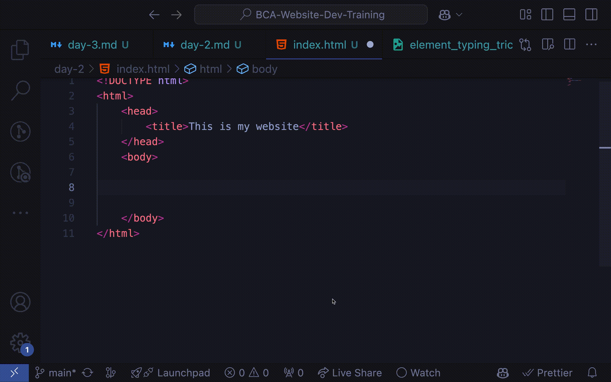

# Day 2


## Environment Setup
- Install code editor [VS Code](https://code.visualstudio.com/)
- Install Vs Code Extensions
  - [Live Server](https://marketplace.visualstudio.com/items?itemName=ms-vscode.live-server)

## Introduction to HTML

- HTML stands for Hyper Text Markup Language
- HTML is the standard markup language for creating Web pages
- HTML describes the structure of a Web page
- HTML consists of a series of elements
- HTML elements tell the browser how to display the content

## HTML Structure
```html
<!DOCTYPE html>
<html>
<head>
    <title>Page Title</title>
</head>
<body>

....


</body>
</html>
```

- ```<!DOCTYPE html>``` declaration defines this document to be HTML5
- The ```<html>``` element is the root element of an HTML page
- The ```<head>``` element contains meta information about the document
- The ```<title>``` element specifies a title for the document
- The ```<body>``` element contains the visible page content

### Important Points:  
- This is the basic structure of an HTML document. This structure is used in every HTML document.
- We write the HTML code inside the body tag.
- Every HTML document should have a head tag and a body tag.
- Every Html tag has an opening tag and a closing tag.
- The closing tag is the same as the opening tag, but with a forward slash (/) before it.

## HTML Headings
```html
<h1>This is heading 1</h1>
<h2>This is heading 2</h2>
<h3>This is heading 3</h3>
<h4>This is heading 4</h4>
<h5>This is heading 5</h5>
<h6>This is heading 6</h6>
```

- In HTML there are 6 heading tags from ```<h1>``` to ```<h6>```.
- ```<h1>``` defines the most important heading. ```<h6>``` defines the least important heading.
  
## HTML Paragraphs
```html
<p>This is a paragraph.</p>
<p>This is another paragraph.</p>
```

- The ```<p>``` tag defines a paragraph.
- When you write a paragraph, you should use the ```<p>``` tag.

### Tips and Tricks:
1. We don't need to write the angle brackets ```<``` and ```>``` manually. We can use Emmet Abbreviation to write the HTML tags. For example, to write the paragraph tag, we can write ```p``` and press the ```Tab``` key. It will automatically generate the paragraph tag.


2. You can create a dummy text by writing lorem and pressing the ```Enter``` key. It will generate a dummy text.
